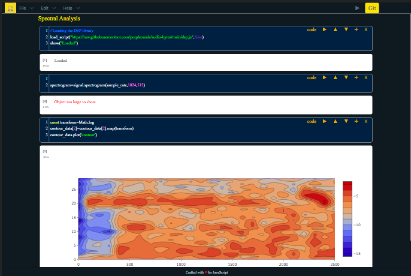

#### [Hello World](https://app.scribble.live) • [Docs](https://scribbler.live/docs)  • [Gallery](https://scribbler.live/samples.html) • [Tutorials](https://scribbler.live/tutorials) • [Discord](https://discord.com/invite/uxNSsWunwU) 

# Scribbler: JavaScript Notebook. [Use here (No login required)](https://app.scribbler.live/#github:gopi-suvanam/jsnb/examples/Hello-world.jsnb). 

Notebook for javascript experimentation (in the browser). Overview:
- [x] Easy to use javascript experimentation tool. Runs without backend (node.js/npm/pip install/ngnix etc etc).  Can be used online or offline.
- [x] Has a minimalistic UI to put focus on user generated code/content. It is light-weight as it uses minimal external libraries for styling.
- [x] Comes pre-loaded with Plotly, D3 and DI-Libs for power usage. Thirdparty libaries/modules can be easily loaded.

[Join Our Discord Server](https://discord.com/invite/uxNSsWunwU)

## Table of contents
<!-- toc -->
1. [Getting Started](#getting-started)
2. [Features](#features)
3. [Use cases](#use-cases)
4. [Collaboration](#collaboration)
5. [Vs. xyz](#how-is-scribbler-different)
6. [Acknowledgements](#acknowledgements)
7. [Additional Resources](#links)

## Getting Started
1. You can start using the hosted version (without downloading anything) here: [https://app.scribbler.live/#](https://app.scribbler.live/#). A hello-world notebook is avaliable here: [Hello World in Scribbler](https://app.scribbler.live/#./examples/Hello-world.jsnb)
3. For offline/local usage - clone this repository (git clone or better still - download) on any machine and double-click index.html. That's it. No Ngnix, no npm, no node, no pip install, no apt-get install. [DOWNLOAD LINK](https://github.com/gopi-suvanam/scribbler/archive/refs/heads/main.zip). I call this a "nodeless" app for two reasons - 1. it does not require node and npm to use.. 2. it does not require a backend runtime.
4. For self-hosted use, you can put the folder in web directory of the server and use the link to index.html.
5. Several examples are available in the folder examples/ of this repository. Check the [README in that folder](./examples/README.md) for links. They can be used as boilerplates for further experimentation.

## Features
- **Cells:**
    - The notebook consists of cells. Each cell will have user inputted html/code and an output. There is a menu at the top right corner of the cell (or above the cell in case of smaller screens).
    - There are two types of cells: code and html. The type of cell can be toggled using a switch in the cell menu.
    - For code cells input and output are both shown. For html cells, input is hidden and opens up if you click the output.
- **Cell Buttons:**
    - To get the output of a cell press play ► button on the cell menu (or Cmd/Ctrl-Enter on keyboard after selecting the cell).
    - The cell menu also has buttons for moving the cell up ↑, down ↓, adding a new cell ✛ and deleting the current cell ☓.
- **Exporting and Importing:**
    - A notebook can be downloaded as json (has a default extension of .jsnb). IT can be loaded back into the app. The notebook or only the output can also be downloaded as html.
    - A .jsnb file can also be directly loaded into the app by suffixing the url of the file after "#" something like: https://app.scribbler.live/#link_to_file.jsnb. The url of the file should be accessible by the browser through GET method.
    - For details on Download/Upload, dowload as html/javascript, push to/pull from Github. See [DOCS](DOCS.md#exporting-importing) for details
- **Special Functions & Features:**
    - Function show(...) can be used to display an object in the output cell.
    - There are two special functions included in the app: show(...) for showing some string in the output box. curr_cell() for getting the element corresponding to the output cell.
    - Keyboard Shortcuts: Several keyboard shortcuts for running/dowloading/adding cells/deleting cells etc. See [DOCS](DOCS.md#keyboard-shortcuts) for details
- **External Libraries:**    
    - [D3](https://github.com/d3/d3) and [Plotly](https://github.com/plotly/plotly.js) (for data manipulation and charting), and sister project [DI-Libs](https://github.com/gopi-suvanam/di-libs) are preloaded and can be used in the notebooks without seperately loading. They can also be reloaded using reload_script.
    - For adding more functionality import an external library through import() or through load_script(CDN_LINK).

## Use cases
1. For trying new libraries for testing and building
2. For building reproducible research and sharing the results with others

Not to be used for:
1. Production use cases
2. As an alternative to webapps
3. Working with sensitive data like login/pwd/private keys etc.

## Collaboration
The tool does not store data on cloud as it is intended to be a fully open source product for self-hosting/use on local machines. A fully hosted solution with collaboration is in the Roadmap. Collabortion is still possible through:
1. Download and share .jsnb files.
2. Use github for storing .jsnb files. Make the repo public or add collaborators. The notebooks built on Scribbler can be directly be synced on to GitHub using an access token.
3. Files in public GitHub repos can be directly accessed as: https://app.scribbler.live/#https://raw.githubusercontent.com/[USERNAME]/[REPO]/[BRANCH]/[PATH_TO_FILE]
4. If GitHub pages are enabled for the repo, the files can be accessed also using this link: https://app.scribbler.live/#https://[USERNAME].github.io/[REPO]/[PATH_TO_FILE]
5. Map a cloud drive or LAN drive onto local machine and load from/download to the drive. Share the drive with collaborators.

## How is Scribbler different
- Scribbler is an open source application and hence can be downloaded, modified and used freely. Jsfiddle/codepen are cloud based platforms.
- Scribbler can have multiple cells so it can create long documents.
- Intended use is for experimenting and computing in javascript. HTML and CSS are secondary in the case of Scribbler. Whereas for Jsfiddle and codepen the main use case to test javascript along with html and css.
- Scribbler can also be used for scientific computation using several open source javascript libraries.
- ObservableHQ is similar in principle to Scribbler but it a walled garden and not an open source tool. Also it uses relies on React framework whereas Scribbler is framework agnostic.

## Acknowledgements
- Uses [Codemirror](https://github.com/codemirror) for formatting the code area
- Uses [Pico CSS](https://github.com/picocss/pico) for styling.
- Comes loaded with [D3](https://github.com/d3/d3) and [Plotly](https://github.com/plotly/plotly.js) for charting.

## Links
Additional documentation for Scribbler:
1. [Docs](https://github.com/gopi-suvanam/jsnb/blob/main/DOCS.md)
2. [Code-docs](https://github.com/gopi-suvanam/jsnb/blob/main/CODE-DOCS.md)
3. [Roadmap](https://github.com/gopi-suvanam/jsnb/blob/main/ROADMAP.md)
4. [Sample Notebooks](https://github.com/gopi-suvanam/jsnb/blob/main/examples/README.md)

